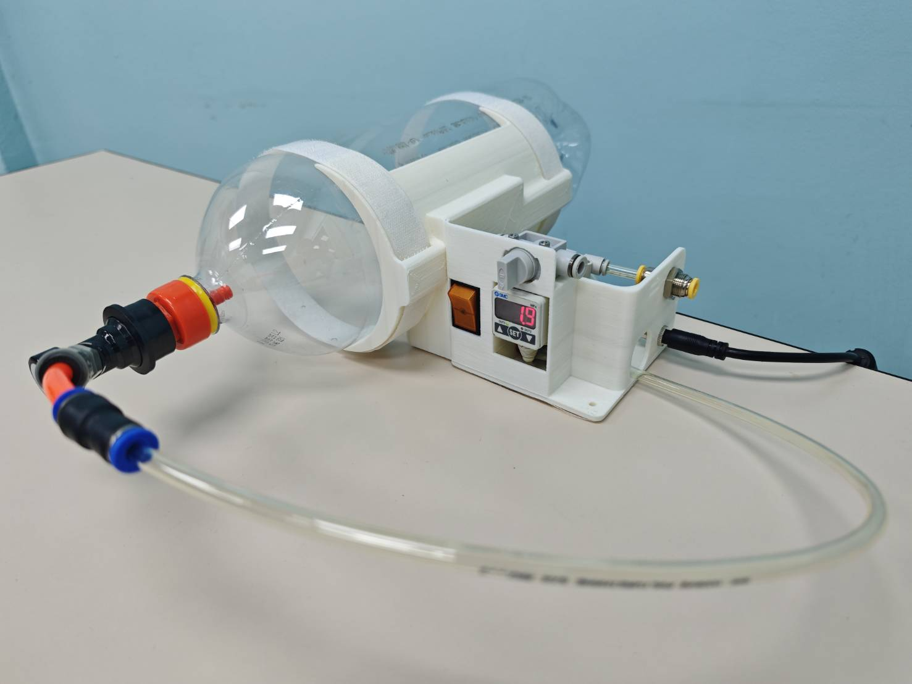

# Smart Air Tank with Regulator Module

## 🔌 Wiring Diagram

Wiring diagram

## 📸 Demonstration Media

## 📌 Project Overview

This project presents a compact air tank integrated with a pressure regulator module, designed to deliver stable, adjustable, and safely limited pneumatic pressure for low-pressure applications. The system combines a lightweight air reservoir with a regulator and standard pneumatic interfaces, forming a standalone air supply unit suitable for laboratory use, rapid prototyping, and educational demonstrations.

The project emphasizes modularity, portability, and controllability, making it ideal for experimental pneumatic systems where conventional compressed air infrastructure is impractical.

## ⚙️ System Description

The air tank serves as the compressed air storage unit, while the integrated regulator module ensures controlled and consistent output pressure. The regulator decouples the outlet pressure from fluctuations in tank pressure, allowing reliable operation of downstream pneumatic components.

The module can be extended with sensors or programmable control units; however, the core contribution of this project is the integration of an air tank and regulator into a compact and portable module.

## ✅ Key Features

Integrated air tank and pressure regulator module

Stable and adjustable output pressure

Lightweight and portable construction

Standard pneumatic fittings for easy integration

Suitable for low-pressure pneumatic systems

## 🧪 Applications

Soft robotics and pneumatic actuators

Educational laboratories and demonstrations

Proof-of-concept mechatronic systems

Mobile or desktop pneumatic setups

## 🚧 Safety Notice

This system is designed for low-pressure use only. Always operate within conservative pressure limits, verify all pneumatic connections, and ensure the compatibility of attached components. This project is intended strictly for experimental and educational use.

## 📂 Repository Structure
/docs        System description and diagrams
/cad         Mechanical drawings and mounting parts
/hardware    Regulator specifications and fittings
/photos      Assembly and prototype images

## 🛠️ Hardware
- **Pressure sensor:** SMC ISE40-T1-22L
- **Solenoid valve:** SMC SYJ512M-5MZ-M5-F

# Hardware details
* [CAD](hardware/AirTankInterface.stl)
* [ISE40-T1-22L Datasheet](https://www.smcpneumatics.com/pdfs/ISE40_ZSE40.pdf)
* [SYJ512M-5MZ-M5-F Datasheet](https://www.smcpneumatics.com/pdfs/SYJ_3PT.pdf)

## 📖 License

This project is provided for research and educational purposes only. Users are responsible for ensuring safe operation in their own implementations.
